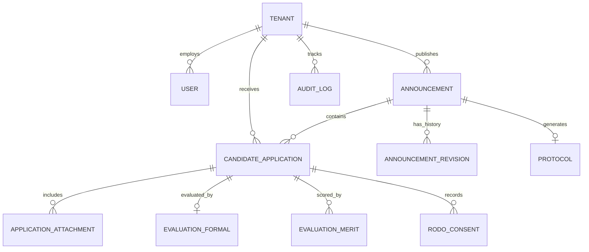

# Data Model & Schema Definition: JST Recruitment Portal

**Feature ID**: `001-jst-recruitment-portal`  
**Date**: 2026-08-27  

---

## 1. Entity Relationship Overview

---

## 2. Table Specifications

### 2.1 `tenants` (JST Instances)
| Column | Type | Constraints | Description |
|---|---|---|---|
| `id` | bigint | PK, Auto-increment | Primary key |
| `name` | string | NOT NULL | Name of JST (e.g. Urząd Gminy X) |
| `slug` | string | Unique, NOT NULL | URL subdomain/slug identifier |
| `logo_path` | string | Nullable | Custom JST logo path |
| `brand_color` | string | Default '#003366' | White-label accent color |
| `retention_days` | integer | Default 90 | RODO retention period in days |
| `require_approval` | boolean | Default false | Require Moderator approval before posting |
| `status` | string | Default 'active' | active, suspended, archived |
| `created_at / updated_at` | timestamp | | Timestamps |

### 2.2 `users` (Administrative Users)
| Column | Type | Constraints | Description |
|---|---|---|---|
| `id` | bigint | PK | Primary key |
| `tenant_id` | bigint | FK -> tenants.id | Tenant association |
| `name` | string | NOT NULL | User full name |
| `email` | string | Unique, NOT NULL | Login email |
| `password` | string | NOT NULL | Hashed password |
| `role` | enum | superadmin, moderator, recruiter | Role permission level |
| `two_factor_code` | string | Nullable | Encrypted 2FA token |
| `two_factor_expires_at`| timestamp | Nullable | Expiration time of 2FA token |
| `created_at / updated_at` | timestamp | | Timestamps |

### 2.3 `announcements` (Job Postings)
| Column | Type | Constraints | Description |
|---|---|---|---|
| `id` | bigint | PK | Primary key |
| `tenant_id` | bigint | FK -> tenants.id | Tenant scope |
| `title` | string | NOT NULL | Job title (e.g. Główny Specjalista) |
| `position_code` | string | Nullable | Official position classification code |
| `category` | string | NOT NULL | Category (financial, legal, IT, general) |
| `location` | string | NOT NULL | Office address / location |
| `contract_type` | string | NOT NULL | Full-time, replacement, indefinite |
| `description` | text | NOT NULL | Full job description |
| `requirements_formal` | text | NOT NULL | Mandatory requirements by law |
| `requirements_merit` | text | Nullable | Additional desirable qualifications |
| `scope_of_duties` | text | NOT NULL | Detailed list of duties |
| `required_documents` | json | NOT NULL | List of mandatory document types |
| `deadline_at` | timestamp | NOT NULL | Submission deadline |
| `status` | string | Default 'draft' | draft, pending_approval, published, expired, cancelled |
| `version` | integer | Default 1 | Content version number |
| `created_at / updated_at` | timestamp | | Timestamps |

### 2.4 `candidate_applications` (Applications)
| Column | Type | Constraints | Description |
|---|---|---|---|
| `id` | bigint | PK | Primary key |
| `tenant_id` | bigint | FK -> tenants.id | Tenant scope |
| `announcement_id` | bigint | FK -> announcements.id | Target posting |
| `first_name` | string | NOT NULL | Applicant first name |
| `last_name` | string | NOT NULL | Applicant last name |
| `email` | string | NOT NULL | Applicant email |
| `phone` | string | Nullable | Applicant phone number |
| `status` | string | Default 'submitted' | submitted, formal_eval, qualified, rejected, interview, selected, withdrawn |
| `tracking_token` | string | Unique, NOT NULL | Secure UUID token for status tracking & withdrawal |
| `is_withdrawn` | boolean | Default false | Application withdrawal flag |
| `withdrawn_at` | timestamp | Nullable | Time of withdrawal |
| `created_at / updated_at` | timestamp | | Timestamps |

### 2.5 `application_attachments` (Uploaded Files)
| Column | Type | Constraints | Description |
|---|---|---|---|
| `id` | bigint | PK | Primary key |
| `candidate_application_id` | bigint | FK -> candidate_applications.id | Parent application |
| `file_type` | string | NOT NULL | cv, cover_letter, statement, qualification |
| `file_path` | string | NOT NULL | Encrypted storage file path |
| `file_name` | string | NOT NULL | Original file name |
| `file_size` | integer | NOT NULL | File size in bytes |
| `created_at` | timestamp | | Upload timestamp |

### 2.6 `evaluations_formal` (Formal Assessment)
| Column | Type | Constraints | Description |
|---|---|---|---|
| `id` | bigint | PK | Primary key |
| `candidate_application_id` | bigint | FK -> candidate_applications.id | Target application |
| `recruiter_id` | bigint | FK -> users.id | Evaluator user |
| `is_complete` | boolean | NOT NULL | Checkbox: All docs attached |
| `meets_requirements` | boolean | NOT NULL | Checkbox: Formal requirements met |
| `justification` | text | Nullable | Explanation note for pass/fail |
| `result` | enum | passed, failed | Formal evaluation outcome |
| `created_at / updated_at` | timestamp | | Assessment timestamps |

### 2.7 `evaluations_merit` (Merit Scoring & Interview)
| Column | Type | Constraints | Description |
|---|---|---|---|
| `id` | bigint | PK | Primary key |
| `candidate_application_id` | bigint | FK -> candidate_applications.id | Target application |
| `recruiter_id` | bigint | FK -> users.id | Evaluator user |
| `score` | integer | Default 0 | Merit score points |
| `interview_notes` | text | Nullable | Confidential interview feedback |
| `recommendation` | string | Nullable | Final recommendation rating |
| `created_at / updated_at` | timestamp | | Assessment timestamps |

### 2.8 `protocols` (Recruitment Protocol)
| Column | Type | Constraints | Description |
|---|---|---|---|
| `id` | bigint | PK | Primary key |
| `announcement_id` | bigint | FK -> announcements.id | Target announcement |
| `generated_by` | bigint | FK -> users.id | Author recruiter |
| `summary` | text | NOT NULL | Summary text of recruitment process |
| `pdf_path` | string | Nullable | Generated protocol PDF path |
| `is_published` | boolean | Default false | Published to public portal / BIP |
| `created_at / updated_at` | timestamp | | Timestamps |

### 2.9 `audit_logs` (System Audit Trail)
| Column | Type | Constraints | Description |
|---|---|---|---|
| `id` | bigint | PK | Primary key |
| `tenant_id` | bigint | FK -> tenants.id, Nullable | Tenant association |
| `user_id` | bigint | FK -> users.id, Nullable | User executing action |
| `action` | string | NOT NULL | e.g., announcement.create, application.view |
| `ip_address` | string | NOT NULL | IP of user |
| `payload` | json | Nullable | Context/diff payload |
| `created_at` | timestamp | | Immutable creation timestamp |
